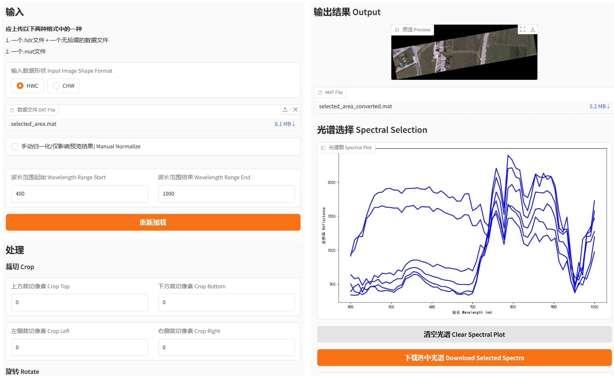
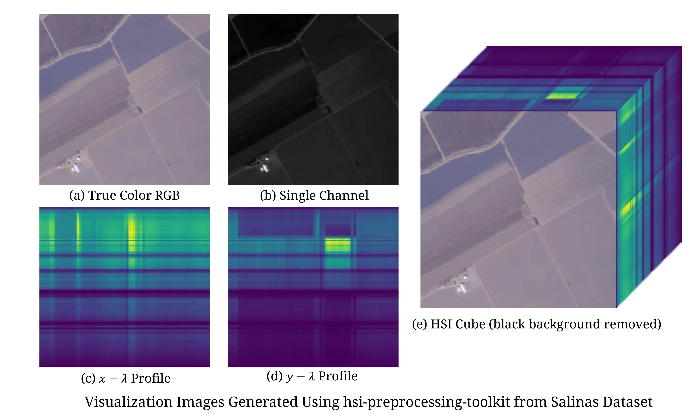
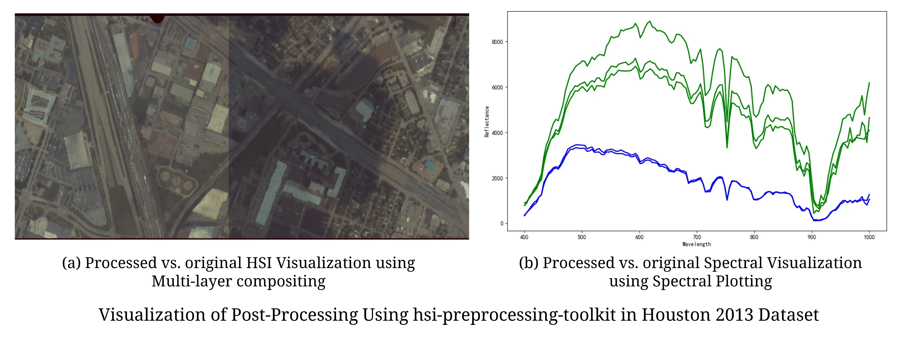

# HSI Preprocessing Toolkit

[](https://pypi.org/project/hsi-preprocessing-toolkit)
[](https://pypi.org/project/hsi-preprocessing-toolkit)
[](https://pypi.org/project/hsi-preprocessing-toolkit)


HSI Preprocessing Toolkit (HPT) is a GUI software designed for seamless preprocessing and visulizing hyperspectral images. It simplifies the transition from raw sensor data to research-ready images with the following features:

- Raw Data Conversion: Directly reads raw data from HSI cameras and exports to `.mat` files.  
- Real-time Manipulation: Crop, rotate, and transform HSI cubes with instant visual feedback.  
- Interactive Selection: Isolate specific spectral regions of interest and save them into compact `.mat` files.  
- Visual Analysis: Preview HSI channels, generate RGB using CIE color matching functions, and plot spectral profiles.  
- Layer-based Composition: Mix multiple HSI cubes using a layer-based system.  

## Installation

### Option 1: Download, Click and Run
1. Download [hpt.cmd](https://github.com/songyz2019/hsi-preprocessing-toolkit/blob/main/script/hpt.cmd) from GitHub release
2. Double click the `hpt.cmd` file. 

### Option 2: Using uv or pip
1. Install: `pip install hsi-preprocessing-toolkit` or `uv tool install hsi-preprocessing-toolkit`
2. Start: `hsi_preprocessing_toolkit`

## Gallery






## Maintaince Status

This project is under **passive maintenance**, focusing on critical bugs, security, and documentation. Related issues and PRs are welcomed.


## FAQ
> Q: How is AI utilized in the codebase?  
> A: We only use AI as a chatbot. We have reviewed every line of code word-for-word, and 99% of the codebase is written by human directly.

> Q: Is there any security protection?  
> A: We implement baseline security practices on a best-effort basis. This includes the use of security tokens for authentication and a principle of least privilege (PoLP) design to minimize potential risks.


## License

```text
Copyright (C) 2025-present  songyz2019

This program is free software: you can redistribute it and/or modify
it under the terms of the GNU Affero General Public License as published by
the Free Software Foundation, either version 3 of the License, or
(at your option) any later version.

This program is distributed in the hope that it will be useful,
but WITHOUT ANY WARRANTY; without even the implied warranty of
MERCHANTABILITY or FITNESS FOR A PARTICULAR PURPOSE.  See the
GNU Affero General Public License for more details.

You should have received a copy of the GNU Affero General Public License
along with this program.  If not, see <https://www.gnu.org/licenses/>.
```
