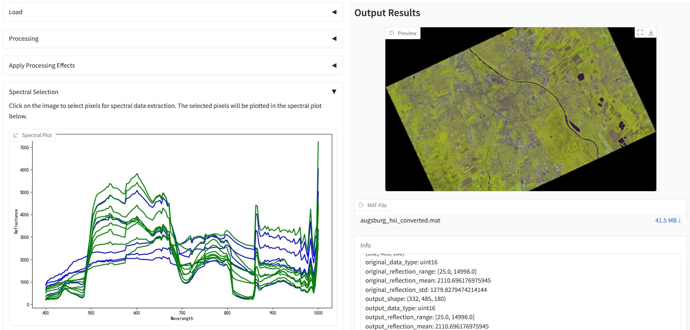

# HSI Preprocessing Toolkit

A Hyperspectral Preprocessing Toolkit that
1. Read the raw data from the HSI camera, and convert it into `.mat` file
2. Read the `.mat` file
3. Preview HSI, and convert it to RGB `.png` file
4. Crop and rotate the HSI and preview in realtime
5. Select spectrals of interest visually and save them into a `.mat` file




## Usage
1. Download from GitHub release
2. Double click the `start.cmd` file

## Credit
1. [uv](https://docs.astral.sh/uv/) for providing a new reliable solution for Python application distribution.  
2. `gradio` for modern Python Data Science UI 
3. `rasterio` for remote sensing data reading
4. `scipy`, `numpy`, `matplotlib` and `einops`
5. For more projects, see `pyproject.toml`


## License

```text
Copyright (C) 2025  songyz2019

This program is free software: you can redistribute it and/or modify
it under the terms of the GNU Affero General Public License as published by
the Free Software Foundation, either version 3 of the License, or
(at your option) any later version.

This program is distributed in the hope that it will be useful,
but WITHOUT ANY WARRANTY; without even the implied warranty of
MERCHANTABILITY or FITNESS FOR A PARTICULAR PURPOSE.  See the
GNU Affero General Public License for more details.

You should have received a copy of the GNU Affero General Public License
along with this program.  If not, see <https://www.gnu.org/licenses/>.
```